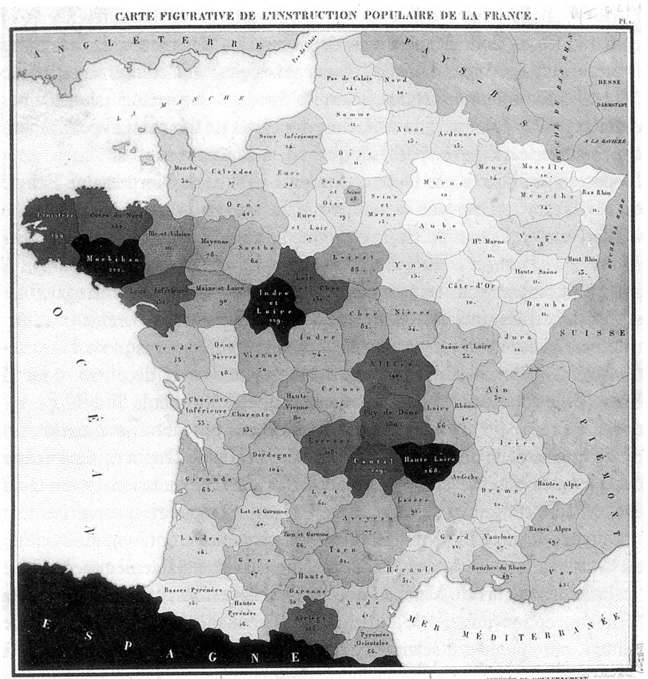
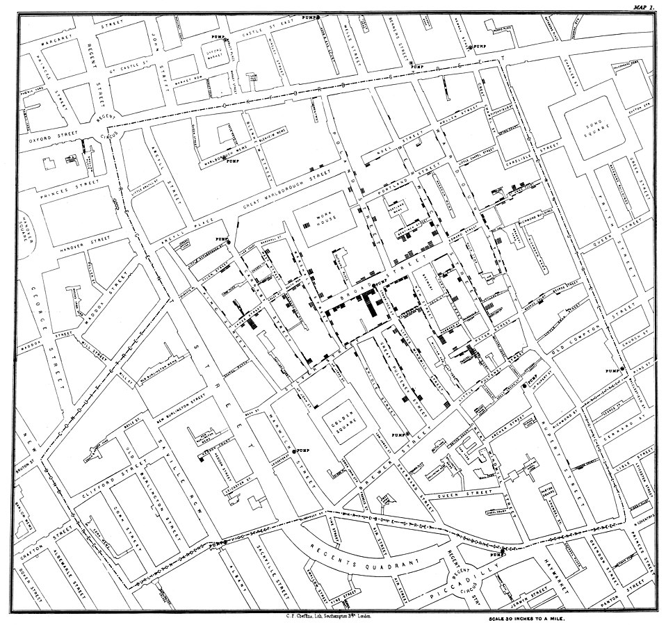
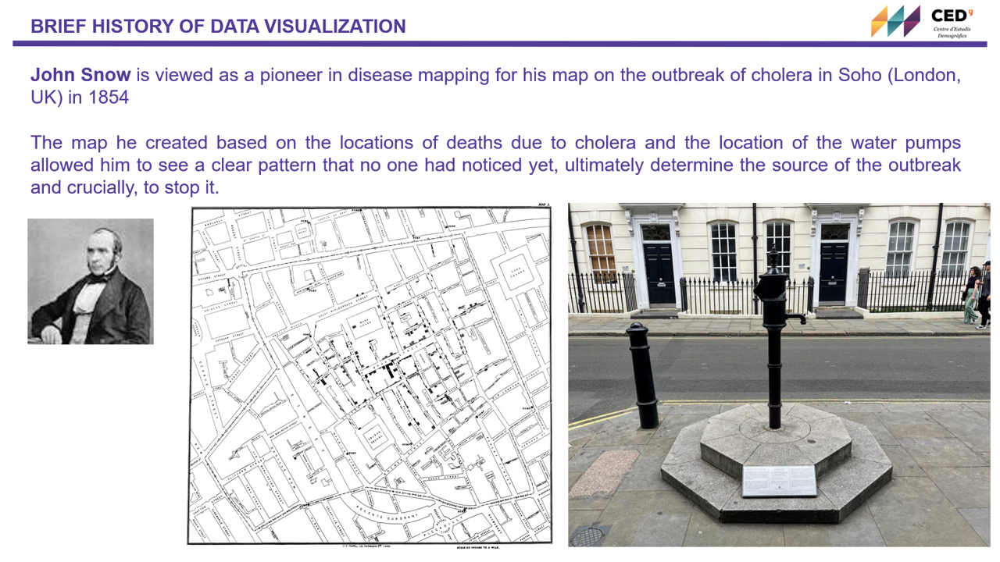

** ** 
**Place and Date:** *BSSD, Barcelona, July 2025*

**Instructor:** [Juan Galeano](https://drive.google.com/file/d/18BRDj7z6MVU_oB0zeL6wY2aygHgaEqfo/view?usp=sharing) 

## Exercise 0: Very basic data manipulation in R 
```{r fig.width=12, fig.height=10,echo = T, message = F, warning=FALSE}

# Create the data frame
library(tidyverse)

df <- data.frame(
  id_census_tract = c(
    "0801901001", "0801901002", "0801901003",
    "0801902001", "0801902002", "2807901001",
    "2807901002", "2807901003", "2807901004",
    "2807902001", "2807902002", "2807903003"
  ),
  country_of_birth = c(
    "Spain", "Spain", "Other",
    "Spain", "Other", "Spain",
    "Spain", "Spain", "Other",
    "Spain", "Spain", "Other"
  ),
  sex = c(1, 1, 1, 2, 1, 2, 1, 1, 2, 1, 2, 1)
)

df

# Add new columns to dataframe: mutate

df<-df|>
  mutate(id_mun=substr(id_census_tract,1,5))

df

# Subset a dataframe: Filter works over rows 

df_mad<-df|>
  filter(id_mun=="28079")

df_mad

df_bcn<-df|>
  filter(id_mun=="08019")

df_bcn

# Subset a dataframe: select works over columns 
names(df)

df1<-df|>
  select(1,2,4)

df1


df1b<-df|>
  select(c("id_census_tract","country_of_birth", "id_mun"))

df1b

df2<-df|>
  select(-3)

df2

df2b<-df|>
  select(-"sex")

df2b
# Group your data: group_by, summarise and ungroup. 

df_mun<-df|>
  group_by(id_mun)|>
  summarise(pop=n())|>
  ungroup()

df_mun

df_mun_origin<-df|>
  group_by(id_mun,country_of_birth)|>
  summarise(pop=n())|>
  ungroup()

df_mun_origin

df_mun_origin_pro<-df|>
  group_by(id_mun,country_of_birth)|>
  summarise(pop=n())|>
  mutate(prop= pop / sum(pop))|> 
  ungroup()

df_mun_origin_pro

df_mean_foreign<-df_mun_origin_pro|>
  mutate(country="Spain")|>
  filter(country_of_birth=="Other")|>
  group_by(country)|>
  summarise(mean_foreign=mean(prop))

df_mean_foreign

# COMPUTE QUANTILES OF A GIVEN DISTRIBUTION 

random_numbers <- rnorm(100, mean = 23, sd = 7)  # Adjust mean/sd as needed
random_numbers <- round(pmin(pmax(random_numbers, 1), 45))

df<-data.frame(id=seq(1:100),
               value=random_numbers)
  
ggplot(df, aes(x = value)) +
       geom_histogram(binwidth = 1, fill = "steelblue", color = "black") +
       labs(title = "Histogram of Values", x = "Value", y = "Count") +
       theme_minimal()               
               
ggplot(df, aes(x = value)) +
  geom_histogram(binwidth = 10, fill = "steelblue", color = "black") +
  labs(title = "Histogram of Values", x = "Value", y = "Frequency") +
  theme_minimal()  

             
quartiles <- quantile(df$value, probs = seq(0, 1, 0.25), na.rm = TRUE)
quartiles                                       

median_value <- quantile(df$value, probs = seq(0, 1, 0.4), na.rm = TRUE)                                           
median_value

percentiles <- quantile(df$value, probs = seq(0, 1, 0.01), na.rm = TRUE)                                           
percentiles

```

## Exercise 1: Crop a map 

It could be the case that we want to zoom in into a particular area of a bigger sf_objet. Let's see how we can achieve this in R. For this exercise we use a map of the world from [gisco](https://ec.europa.eu/eurostat/web/gisco), the Geographic Information System of the European Commission. We can easily access the spatial information of gisco using the [giscoR](https://ropengov.github.io/giscoR/) library. **giscoR** is an API package that helps to retrieve data from Eurostat - GISCO (the Geographic Information System of the European Commission). 

```{r fig.width=16.5, fig.height=9.8,echo = T, message = F, warning=FALSE}
library(giscoR)
library(sf)
library(tidyverse)

world <- gisco_get_countries(
  resolution = "03", region = NULL,
  epsg = 4326
)
st_crs(world)

ggplot(data = world) +
  geom_sf(fill="antiquewhite")+
  theme_bw()+
  theme(panel.background = element_rect(fill = "aliceblue"))

# For this example I'm using the bbox of Spain. If you need the coordinates
# of a bbox of any part of the world you can get them from https://www.openstreetmap.org/

ggplot(data = world) +
  geom_sf(fill="antiquewhite")+
  theme_bw()+
coord_sf(
  xlim = c(-11.54, 8.90),
  ylim = c(35.26, 44.32))+
  theme_bw()+
  theme(panel.background = element_rect(fill = "aliceblue"))
```

## Choropleth maps

A choropleth map (from Greek χῶρος (choros) 'area/region', and πλῆθος (plethos) 'multitude') is a type of statistical thematic map that uses intensity of color to correspond with an aggregate summary of a geographic characteristic within spatial enumeration units, such as population density or income per-capita.     

**1826 The first choropleth Map by Charles Dupin**

This shaded map of French popular education shows the number of inhabitants per male pupils in French departments with lighter shaded departments sending more boys to school than the darker ones.


[Charles Dupin](https://en.wikipedia.org/wiki/Charles_Dupin)

```{r instagram_embed, echo=FALSE, out.width="100%",  message = F, warning=FALSE}
library(webshot2) 
knitr::include_url("https://en.wikipedia.org/wiki/Charles_Dupin")
```


## Exercise 2: Choropleth maps (Foreign-born population by my municipalty, Madrid 2022)      

We aim to produce a choropleth map with the percentage of foreign-born population by municipalities in the year 2022 as the one below.
We are provided with two sets of data. **PC2022** is the population register data from the National Statistics Institute of Spain (statistical data), each row is a person. **SECC_CE_20220101** is a shapefile with the division of Spain by census tracts in 2022 (spatial data), each row is census tract. Let's draw together the mental path about how we will need to proceed.  

 


#### 1. Read statistical data into R       

Read the population register data into R and create a dataframe showing the proportion of foreign-born population by municipalities in Madrid. We also create some _pretty breaks_ for our variable of interest.


```{r fig.width=16.5, fig.height=9.8,echo = T, message = F, warning=FALSE}
library(sf)
library(tidyverse)
path<-"C:\\Users\\jgaleano\\Desktop\\ADAM\\SESSION_2\\shps_data\\"
images<-"C:\\Users\\jgaleano\\Desktop\\ADAM\\SESSION_2\\images\\"


load(paste(path,"PC2022.Rda",sep=""))

mad_muns_data <- data |>
  filter(PROVINCIA == "28") |>
  mutate(PAISNAC2 = if_else(PAISNAC == "108", "108", "999")) |>
  group_by(MUNICIPIO, PAISNAC2) |>
  summarise(pop = n()) |>
  ungroup() |>
  group_by(MUNICIPIO) |>
  mutate(prop = pop / sum(pop)) |>
  ungroup() |>
  filter(PAISNAC2 == "999") |>
  mutate(
    prop_foreign_cat = case_when(
      prop <= .05 ~ "<5%",
      prop <= .10 ~ "(5-10%]",
      prop <= .15 ~ "(10-15%]",
      prop <= .20 ~ "(15-20%]",
      prop <= .25 ~ "(20-25%]",
      prop <= .30 ~ "(25-30%]",
      prop > .30 ~ ">30%"
    ),
    prop_foreign_cat = fct_relevel(
      factor(prop_foreign_cat),
      "<5%",
      "(5-10%]",
      "(10-15%]",
      "(15-20%]",
      "(20-25%]",
      "(25-30%]",
      ">30%"
    )
  )

head(mad_muns_data)

```


#### 2. Read spatiaL data into R       

Read the spatial data into R and create a sf object with the division of Madrid by municipalities. 


```{r fig.width=16.5, fig.height=9.8,echo = T, message = F, warning=FALSE}
shp_ct  <- read_sf(dsn = path, "SECC_CE_20220101")

mad_muns_shp <- shp_ct |>
  filter(CPRO == "28") |>
  group_by(CUMUN) |>
  summarise(NMUN = unique(NMUN)) |>
  st_buffer(0.5) %>%
  st_cast() 

colnames(mad_muns_shp)[1]<-"MUNICIPIO"

# note: the st_buffer function helps us cleaning sliver, however it can create some misalignment between layers. 

ggplot(mad_muns_shp) +
  geom_sf() +
  theme_bw()
```

#### 3. Join statistical and spatial data       


```{r fig.width=16.5, fig.height=9.8,echo = T, message = F, warning=FALSE}
mad_muns_shp <- mad_muns_shp |>
  left_join(mad_muns_data, by = "MUNICIPIO")

head(mad_muns_shp)

```

#### 4. Create a color palette to associate it with the data

[Color Brewer](https://colorbrewer2.org/#type=sequential&scheme=BuGn&n=3)

```{r fig.width=16.5, fig.height=9.8,echo = T, message = F, warning=FALSE}
library(RColorBrewer)

display.brewer.all()

myColors <- c(brewer.pal(7, "YlOrRd"))
barplot(rep(length(myColors), length(myColors)), col = c(myColors));myColors
```


#### 5. Plot a choropleth map (categories) with municipal boundaries and save it as an image

```{r fig.width=11, fig.height=10,echo = T, message = F, warning=FALSE}
Map1 <- ggplot(mad_muns_shp, aes(fill = prop_foreign_cat)) +
  geom_sf(colour = "black", linewidth = .1) +
  scale_fill_manual(name = "Foreign-born (%)", values = myColors) +
  labs(
    x = "\nLongitude",
    y = "Latitude\n",
    title = "Foreign-born population by municipality",
    subtitle = "Madrid 2022",
    caption = "Elaboration: Juan Galeano\nData: Population Register (INE)"
  ) +
  theme_bw()

Map1


ggsave(
  paste(images, "Madrid1.png", sep = ""),# name of the file of the image
  scale = 1,
  dpi = 300,
  height = 10,
  width = 11
)
```

#### 6. Plot a choropleth map (categories) with municipal boundaries, add north row and scale bar. Updated theme.

```{r fig.width=9, fig.height=10,echo = T, message = F, warning=FALSE}
library(ggspatial)

Map2 <- ggplot(mad_muns_shp, aes(fill = prop_foreign_cat)) +
  geom_sf(colour = "black", linewidth = .1) +
  scale_fill_manual(
    name = "Foreign-born (%)",
    values = myColors,
    # Legend
    
    guide = guide_legend(
      title.position = "top",
      title.hjust = 0.5,
      direction = "horizontal",
      nrow = 1,
      keywidth = 4,
      keyheight = .5,
      label.position = "bottom"
    )
  ) +
  labs(
    x = "\nLongitude",
    y = "Latitude\n",
    title = "Foreign-born population by municipality",
    subtitle = "Madrid 2022",
    caption = "Elaboration: Juan Galeano | Data: Population Register (INE)"
  ) +
  theme_bw() +
  theme(
    plot.title = element_text(hjust = 0.5, face = "bold"),
    plot.subtitle = element_text(hjust = 0.5, face = "bold"),
    plot.caption  = element_text(hjust = 0.5),
    axis.text = element_blank(),
    axis.title = element_blank(),
    axis.ticks = element_blank(),
    legend.position = "bottom"
  ) +
  annotation_scale(location = "bl", width_hint = 0.5) +
  annotation_north_arrow(
    location = "bl",
    which_north = "true",
    pad_x = unit(0.75, "in"),
    pad_y = unit(0.5, "in"),
    style = north_arrow_fancy_orienteering
  )

Map2

ggsave(paste(images,"Madrid2.png",sep=""), # name of the file of the image
       scale = 1, 
       dpi = 300,     
       height =10, #25  #10 
       width = 9)

```

#### 7. Provide Context: Add a subplot in map.

```{r fig.width=9, fig.height=10,echo = T, message = F, warning=FALSE}

CCAASHP   <- read_sf(dsn = path, "ESP_PROV_CAN")
ggplot(data = CCAASHP) +
  geom_sf() +
  theme_bw()

CCAASHP <- CCAASHP %>%
  mutate(col = if_else(ID_1 == 8, 1, 0))

myColors3 <- c("#BDBDBD", "#FF0000")
CCAASHP$col <- as.factor(CCAASHP$col)

ESP <- ggplot(CCAASHP, aes(fill = col)) +
  geom_sf(colour = "Black", linewidth = .015) +
  coord_sf() +
  scale_fill_manual(name = "", values = myColors3) +
  labs(title = "Spain") +
  theme(
    plot.title = element_text(
      lineheight = 5.6,
      size = 15,
      face = "bold"
    ),
    legend.title = element_text(
      angle = 0,
      vjust = 0.5,
      size = 15,
      colour = "black",
      face = "bold"
    ),
    legend.text = element_text(colour = "black", size = 15),
    legend.position = 'none',
    legend.justification = c(1, 0),
    legend.background = element_rect(fill = NA),
    legend.key.size = unit(1.5, 'lines'),
    strip.text = element_text(
      angle = 0,
      vjust = 0.5,
      size = 15,
      colour = "black",
      face = "bold"
    ),
    axis.title.x = element_blank(),
    axis.text.x  = element_blank(),
    axis.title.y = element_blank(),
    axis.text.y  = element_blank(),
    axis.ticks = element_blank(),
    panel.grid.major = element_line(colour = NA),
    plot.background =  element_rect(fill = NA),
    panel.background = element_rect(fill = "white", colour = "white"),
    panel.border = element_rect(
      color = "black",
      linewidth   = .5,
      fill = NA
    )
  )

ESP

Map3 <- ggplot(mad_muns_shp, 
               aes(fill = prop_foreign_cat)) + 
  geom_sf(colour = "black",linewidth=.1) + 
  scale_fill_manual(name="Foreign-born (%)",
                    values=myColors,
                    # Legend
                    
                    guide = guide_legend(  
                      title.position = "top", 
                      title.hjust=0.5,
                      direction = "horizontal",
                      nrow = 1,
                      keywidth=4,
                      keyheight=.5,
                      label.position = "bottom"))+
  labs(x="\nLongitude",
       y="Latitude\n",
       title="Foreign-born population by municipality",
       subtitle="Madrid 2022",
       caption="Elaboration: Juan Galeano | Data: Population Register (INE)")+
  theme_bw()+
  theme(plot.title = element_text(hjust=0.5,face="bold"),
        plot.subtitle = element_text(hjust=0.5,face="bold"),
        plot.caption  = element_text(hjust=0.5),
        axis.text = element_blank(),
        axis.title = element_blank(),
        axis.ticks = element_blank(),
        legend.position = "bottom")+
  annotation_scale(location = "bl", width_hint = 0.5) + 
  annotation_north_arrow(location = "bl", 
                         which_north = "true", 
                         pad_x = unit(0.75, "in"), 
                         pad_y = unit(0.5, "in"), 
                         style = north_arrow_fancy_orienteering)+
  annotation_custom(grob = ggplotGrob(ESP), 
                    xmin = 359000,
                    xmax = 415000, 
                    ymin = 4457310,
                    ymax = 4627310)

Map3

ggsave(paste(images,"Madrid3.png",sep=""), # name of the file of the image
       scale = 1, 
       dpi = 300,     
       height =10, #25  #10 
       width = 9)
```

#### 8. Provide Context: Get map tile the **ggmap** approach

```{r fig.width=9, fig.height=10,echo = T, message = F, warning=FALSE}
library(ggmap)
# note osm for getting bbox

st_bbox(mad_muns_shp)

# Transform CRS 
mad_muns_shp_t <- st_transform(mad_muns_shp, 4326)
st_bbox(mad_muns_shp_t)

mad_terrain<-get_stadiamap(bbox = c(left = as.numeric(st_bbox(mad_muns_shp_t)[1]), 
                                      bottom = as.numeric(st_bbox(mad_muns_shp_t)[2]), 
                                      right = as.numeric(st_bbox(mad_muns_shp_t)[3]),
                                      top = as.numeric(st_bbox(mad_muns_shp_t)[4])), 
                             zoom = 10, 
                             maptype = c("stamen_terrain"), 
                             crop = TRUE, 
                             messaging = FALSE)

# MAPTYPES
#stamen_terrain, stamen_toner, stamen_toner_lite, stamen_watercolor, stamen_terrain_background, stamen_toner_background, stamen_terrain_lines, stamen_terrain_labels, stamen_toner_lines, stamen_toner_labels.

mad_terrain <- ggmap(mad_terrain,
                     extent = "panel",
                     legend = "topleft",
                     darken = 0)
mad_terrain

Map4 <- mad_terrain +
  geom_sf(
    data = mad_muns_shp_t,
    aes(fill = prop_foreign_cat),
    colour = "black",
    linewidth = .1,
    inherit.aes = FALSE
  ) +
  scale_fill_manual(
    name = "Foreign-born (%)",
    values = myColors,
    # Legend
    
    guide = guide_legend(
      title.position = "top",
      title.hjust = 0.5,
      direction = "horizontal",
      nrow = 1,
      keywidth = 4,
      keyheight = .5,
      label.position = "bottom"
    )
  ) +
  labs(
    x = "\nLongitude",
    y = "Latitude\n",
    title = "Foreign-born population by municipality",
    subtitle = "Madrid 2022",
    caption = "Elaboration: Juan Galeano | Data: Population Register (INE)"
  ) +
  theme_bw() +
  theme(
    plot.title = element_text(hjust = 0.5, face = "bold"),
    plot.subtitle = element_text(hjust = 0.5, face = "bold"),
    plot.caption  = element_text(hjust = 0.5),
    axis.text = element_blank(),
    axis.title = element_blank(),
    axis.ticks = element_blank(),
    legend.position = "bottom"
  ) +
  annotation_scale(location = "bl", width_hint = 0.45) +
  annotation_north_arrow(
    location = "bl",
    which_north = "true",
    pad_x = unit(0.75, "in"),
    pad_y = unit(0.5, "in"),
    style = north_arrow_fancy_orienteering
  )

Map4

ggsave(paste(images,"Madrid4.png",sep=""), # name of the file of the image
       scale = 1, 
       dpi = 300,     
       height =10, #25  #10 
       width = 9)
```

#### 9. Provide more information: add and histogram to your choropleth map

```{r fig.width=10, fig.height=13,echo = T, message = F, warning=FALSE}
ggplot(mad_muns_data, aes(x=prop)) + 
  geom_histogram()

# Create a theme for plotting #####
theme_fancy_map <- function() {
  theme_void() +
    theme(
      plot.title = element_text(
        face = "bold",
        hjust = 0.13,
        size = rel(1.4)
      ),
      plot.subtitle = element_text(hjust = 0.13, size = rel(1.1)),
      plot.caption = element_text(
        hjust = 0.13,
        size = rel(0.8),
        color = "grey50"
      ),
    )
}

hist_legend <- ggplot(mad_muns_data, aes(x = prop)) +
  # Fill each histogram bar using the x axis category that ggplot creates
  geom_histogram(
    aes(fill = after_stat(factor(x))),
    binwidth = .05,
    boundary = 0,
    color = "black",
    linewidth = 0.1
  ) +
  geom_text(
    stat = "bin",
    binwidth = .05,
    boundary = 0,
    aes(label = after_stat(count)),
    vjust = -0.5,
    size = 3.5
  ) +
  coord_cartesian(ylim = c(0, 85)) +
  # Fill with the same palette as the map
  scale_fill_brewer(palette = "YlOrRd", guide = "none") +
  scale_x_continuous(
    breaks = seq(0, .35, by = .05),
    labels = c("0%", "5", "10", "15", "20", "25", "30", "35%")
  ) +
  labs(x = "Foreign-born") +
  # Theme adjustments
  theme_fancy_map() +
  theme(
    axis.text.x = element_text(size = rel(1)),
    axis.title.x = element_text(
      size = rel(1),
      margin = margin(t = 1, b = 1),
      face = "bold"
    )
  )
hist_legend

mad_toner<-get_stadiamap(bbox = c(left = as.numeric(st_bbox(mad_muns_shp_t)[1]), 
                                      bottom = as.numeric(st_bbox(mad_muns_shp_t)[2]), 
                                      right = as.numeric(st_bbox(mad_muns_shp_t)[3]),
                                      top = as.numeric(st_bbox(mad_muns_shp_t)[4])), 
                             zoom = 11, 
                             maptype = c("stamen_toner"), 
                             crop = TRUE, 
                             messaging = FALSE)

# MAPTYPES
#stamen_terrain, stamen_toner, stamen_toner_lite, stamen_watercolor, stamen_terrain_background, stamen_toner_background, stamen_terrain_lines, stamen_terrain_labels, stamen_toner_lines, stamen_toner_labels.

mad_toner <- ggmap(mad_toner,
                     extent = "panel",
                     legend = "topleft",
                     darken = 0)


map1 <- mad_toner +
  geom_sf(
    data = mad_muns_shp_t,
    aes(fill = prop),
    linewidth = .1,
    color = "black",
    inherit.aes = FALSE
  ) +
  scale_fill_stepsn(
    colours = scales::brewer_pal(palette = "YlOrRd")(7),
    breaks = seq(0, 0.35, by = .05),
    limits = c(0, .35),
    labels = c("0%", "5", "10", "15", "20", "25", "30", "35%")
  ) +
  # Theme stuff
  theme_fancy_map() +
  theme(legend.position = "none")

# Add the histogram to the map
library(patchwork)

combined_map_hist <- map1 +
  inset_element(
    hist_legend,
    left = 0.025,
    bottom = 0.025,
    right = 0.4,
    top = 0.25
  )

combined_map_hist

ggsave(
  paste(images, "Madrid4b.png", sep = ""),
  plot = combined_map_hist,
  scale = 1,
  dpi = 300,
  height = 13,
  width = 10
)

```


## Cholera outbreak 1854: The Jhon Snow map 





```{r instagram_embed2, echo=FALSE, out.width="100%",  message = F, warning=FALSE}
library(webshot2) 
knitr::include_url("https://en.wikipedia.org/wiki/John_Snow")
```

## Exercise 3: Heatmaps, The cholera outbreak in Soho 

```{r fig.width=13, fig.height=12,echo = T, message = F, warning=FALSE}
library(ggmap)

shp_deaths <- read_sf(path, "Cholera_Deaths")
shp_pumps <- read_sf(path, "Pumps")

shp_deaths <- st_transform(shp_deaths, 4326)
shp_pumps <- st_transform(shp_pumps, 4326)

bbox <- st_bbox(shp_deaths)

left<-(as.numeric(bbox[1])-mean(as.numeric(bbox[c(1,3)])))*1.5+mean(as.numeric(bbox[c(1,3)]))
right<-(as.numeric(bbox[3])-mean(as.numeric(bbox[c(1,3)])))*1.5+mean(as.numeric(bbox[c(1,3)]))
bottom<-(as.numeric(bbox[2])-mean(as.numeric(bbox[c(2,4)])))*1.5+mean(as.numeric(bbox[c(2,4)]))
top<-(as.numeric(bbox[4])-mean(as.numeric(bbox[c(2,4)])))*1.5+mean(as.numeric(bbox[c(2,4)]))


shp_deaths <- cbind (shp_deaths, st_coordinates(shp_deaths))

soho <- get_stadiamap(
  bbox = c(
    left = left,
    bottom = bottom,
    right = right,
    top = top
  ),
  zoom = 18,
  maptype = c("alidade_smooth"),
  crop = TRUE,
  messaging = FALSE
)

soho <- ggmap(soho)
soho 

soho1 <- soho +
  geom_sf(
    data = shp_deaths,
    size = 3.5,
    color = "red",
    inherit.aes = FALSE
  ) +
  geom_sf(
    data = shp_pumps,
    size = 5,
    shape = 15,
    color = "blue",
    inherit.aes = FALSE
  ) +
  theme_bw()

soho1

ggsave(
  paste(images, "9_POINT_MAP.png", sep = ""),
  scale = 1,
  height = 12,
  width = 20,
  dpi = 300
)

theme_snow<-list(theme(plot.title = element_text(lineheight=1, size=30, face="bold",hjust = 0.5), 
                     plot.subtitle = element_text(lineheight=1, size=25, face="bold",hjust = 0.5), 
                     plot.caption = element_text(lineheight=1, size=15, hjust=0.5), 
                     legend.title = element_blank (),
                     legend.text = element_text(colour="black", size = 13), 
                     legend.position="bottom", 
                     legend.background = element_rect(fill=NA, colour = NA), 
                     legend.key.size = unit(1.5, 'lines'), 
                     legend.key = element_rect(colour = NA, fill = NA), 
                     axis.title.x = element_blank (),
                     axis.text.x  = element_blank (), 
                     axis.title.y =  element_blank (), 
                     axis.text.y  = element_blank (), 
                     axis.ticks= element_blank (), 
                     strip.text = element_text(size=15, face="bold",margin = margin(.1,0,.1,0, "cm")), 
                     plot.background =  element_rect(fill = "white"), 
                     panel.grid.major=element_line(colour="white",linewidth=.5), 
                     panel.grid.minor=element_line(colour="white",linewidth=.15), 
                     panel.border = element_rect(colour = "white", fill=NA, linewidth=.75), 
                     panel.background =element_rect(fill ="#FFFFFF", colour = "#FFFFFF")))

soho2 <- soho +
  stat_density2d(
    aes(x = X, y = Y, fill = ..level..),
    #colour= ..level..
    alpha = .15,
    bins = 15,
    color = "black",
    linewidth = 0.1,
    data = shp_deaths,
    geom = "polygon"
  ) +
  scale_fill_gradient2 (
    'Cholera Deaths\n2D Density',
    low = '#2b83ba',
    mid = '#ffffbf',
    high = '#d7191c',
    midpoint = 50000
  ) +
  geom_sf(
    data = shp_pumps,
    size = 5,
    shape = 15,
    color = "blue",
    inherit.aes = FALSE
  ) +
  labs(title = "Cholera Outbreak 1834",
       subtitle = "Soho, London (UK)",
       caption = "\nElaboration: Juan Galeano for the BSSD\nData: https://search.r-project.org/CRAN/refmans/HistData/html/Snow.html") +
  theme_snow +
  theme(legend.position = "bottom",
        legend.key.width = unit(5, "cm"))

soho2
ggsave(paste(images,"10_HEATMAP.png",sep=""),
       scale = 1,
       height = 12,
       width=13, 
       dpi = 300)

```


## CONSOLIDATION EXCERCISE 1: Choropleth maps

[The OCDE produces a series of indicators on violence against women](https://www.oecd.org/en/data/indicators/violence-against-women.html).
In folder **shps_data** you have the csv file **violence_women** which contains information on the percentage of women who have experienced physical and/or sexual violence from an intimate partner at some time in their life for the year 2020. Your tasks are: 

1. Read "violence_women.csv" file into R.

2. Join the csv data to your world sf object.

3. Replace NA values in column value with zeros. Hint:

```{r fig.width=12, fig.height=12,echo = T, message = F, warning=FALSE}
# shp_violence$Value[is.na(shp_violence$Value)] <- 0
```

4. Create some pretty breaks for your data, as the ones in the image below. Equal 0 to No Data. 

5. Create a color palette for your map and plot in showing only the cases of
Europe, as in the image below. 

6. Save your map as an image. 

```{r fig.width=12, fig.height=12,echo = F, message = F, warning=FALSE}

library(readr)
shp_violence <- world

df_violence <- read_csv("C:\\Users\\jgaleano\\Desktop\\ADAM\\SESSION_2\\shps_data\\violence_women.csv")


shp_violence<-shp_violence%>%
  left_join(df_violence,by ="ISO3_CODE")

shp_violence$Value[is.na(shp_violence$Value)] <- 0

shp_violence$cats<-with(shp_violence,
                      ifelse(Value==0,"No data",
                             ifelse(Value<10,"<10%",
                                    ifelse(Value<15,"10-15%",
                                           ifelse(Value<20,"15-20%",
                                                  ifelse(Value<25,"20-25%",
                                                         ifelse(Value<30,"25-30%",
                                                                ifelse(Value<35,"30-35%",
                                                                       ifelse(Value>=35,">35%",
                                                                              "No data")))))))))

shp_violence$cats<-factor(shp_violence$cats,
                        levels=c("<10%",
                                 "10-15%",
                                 "15-20%",
                                 "20-25%", 
                                 "25-30%",  
                                 "30-35%",
                                 ">35%",
                                 "No data"))

myColors_v <- c(brewer.pal(7, "RdPu"), "#bfbfbf")
#barplot(rep(length(myColors_v),length(myColors_v)), col=c(myColors_v));myColors_v

shp_violence <- st_transform(shp_violence, 3035)

Map9 <- ggplot() + 
  geom_sf(data= shp_violence, aes(fill = cats),
          colour = "Black",linewidth=.025) + 
  coord_sf(
    xlim = c(2377294, 7453440),
    ylim = c(1313597, 5628510))+ 
  scale_fill_manual(name="",values=myColors_v,
                    # Legend
                    guide = guide_legend(direction = "horizontal",
                                         nrow = 1,
                                         keywidth=4,
                                         label.position = "bottom"))+
  labs(title="Percentage of women who have experienced physical and/or sexual violence\nfrom an intimate partner at some time in their life",
       subtitle="Year 2020",
       caption="\nElaboration: Juan Galeano\nData: OECD (2020), Violence against women indicator")+
  theme_bw() +
  theme(plot.title = element_text(size=14, face="bold"),
        plot.caption = element_text(size = 12, face = "italic"),
        legend.position = "bottom")

Map9
ggsave(paste(images,"EX1_violence.png",sep=""),
       scale = 1,
       height = 12,
       width=12, 
       dpi = 300)
```

7. Change the CRS for creating a spherical representation of previous map. 

```{r fig.width=12, fig.height=12,echo = T, message = F, warning=FALSE}

Map10 <- ggplot() + 
  geom_sf(data= shp_violence, aes(fill = cats),
          colour = "Black",linewidth=.025) + 
  scale_fill_manual(name="",values=myColors_v,
                    # Legend
                    guide = guide_legend(direction = "horizontal",
                                         nrow = 1,
                                         keywidth=4,
                                         label.position = "bottom"))+
 coord_sf(crs = "+proj=laea +lat_0=52 +lon_0=10 +x_0=4321000 +y_0=3210000 +ellps=GRS80 +units=m +no_defs ")+
  labs(title="Percentage of women who have experienced physical and/or sexual violence\nfrom an intimate partner at some time in their life",
       subtitle="Year 2020",
       caption="\nElaboration: Juan Galeano\nData: OCED (2020), Violence against women indicator")+
  theme_bw() +
  theme(plot.title = element_text(size=14, face="bold"),
        plot.caption = element_text(size = 12, face = "italic"),
        legend.position = "bottom")

Map10
ggsave(paste(images,"EX1_SPHERICAL.png", sep=""),
       scale = 1,
       height = 12,
       width=12, 
       dpi = 300)
``` 


## CONSOLIDATION EXCERCISE 2: Airbnbs in Barcelona

[Inside Airbnb](https://insideairbnb.com/) is a mission driven project that provides data and advocacy about Airbnb's impact on residential communities. They provide data on the location and type of the accommodations offered in the Airbnb's platform for a huge number if cities.      

File **AIRBNB_BCN.Rdata** contains information about the AirBnB offers in the city of Barcelona. **bcn_districts.shp** is a shapefile with the delimitation by districts of Barcelona.

1.  Read both files into R and answer the following questions: Do this sf object have the same CRS? Act in consequence.

2.  Produce a heatmap with the location of the airbnb accommodations.

3.  Add a map tile as map background and the delimitation of the districts.

4.  Focus the final map on the city centre, as shown in the map below.

5.  Save your map as an image.

```{r fig.width=13, fig.height=12,echo = F, message = F, warning=FALSE}
load(paste(path,"AIRBNB_BCN.Rdata",sep="")) 

DIST_BCN <- read_sf(path, "bcn_districts")

DIST_BCN2<-st_transform(
  DIST_BCN,4326)

bbox<-st_bbox(AIRBNB_BCN)

left<-(as.numeric(bbox[1])-mean(as.numeric(bbox[c(1,3)])))*1.5+mean(as.numeric(bbox[c(1,3)]))
right<-(as.numeric(bbox[3])-mean(as.numeric(bbox[c(1,3)])))*1.5+mean(as.numeric(bbox[c(1,3)]))
bottom<-(as.numeric(bbox[2])-mean(as.numeric(bbox[c(2,4)])))*1.5+mean(as.numeric(bbox[c(2,4)]))
top<-(as.numeric(bbox[4])-mean(as.numeric(bbox[c(2,4)])))*1.5+mean(as.numeric(bbox[c(2,4)]))

BCN_TILE<-get_stadiamap(bbox = c(left = left, 
                             bottom = bottom, 
                             right = right,
                             top = top ), 
                    zoom = 14,  
                    maptype = c("stamen_toner_lite"), 
                    crop = TRUE,
                    messaging = FALSE)

BCN_TILE <- ggmap(BCN_TILE)
#BCN_TILE 

AIRBNB_BCN<- cbind (AIRBNB_BCN,st_coordinates(AIRBNB_BCN))
points_BCN<- st_centroid(DIST_BCN2)
points_BCN <- cbind(DIST_BCN2, st_coordinates(st_centroid(points_BCN$geometry)))


BCN_HEATMAP <- BCN_TILE+
  stat_density2d(aes(x = X, 
                     y = Y, 
                     fill = after_stat(level)), #colour= ..level.. 
                 color="black",
                 alpha=.45,
                 bins = 12, 
                 linewidth=0.1,
                 data = AIRBNB_BCN, 
                 geom = "polygon")+ 
  scale_fill_gradient2 ('Cholera Deaths\n2D Density',
                        low = '#2b83ba', 
                        mid = '#ffffbf',
                        high = '#d7191c', 
                        midpoint=500)+
    labs(title="AIRBNB ACCOMODATIONS",
       subtitle="Barcelona, 2022",
       caption="\nElaboration: Juan Galeano for the BSSD\nData: http://insideairbnb.com/")+
  geom_sf(data=DIST_BCN2, linewidth=.5,fill=NA,color="black",inherit.aes = FALSE)+
  geom_sf(data=AIRBNB_BCN, size=.25, shape=15, alpha=.5,color="black",inherit.aes = FALSE)+
  geom_label(data= points_BCN,
             aes(x=X, y=Y, label=NOM),
             color = "black", 
             fontface = "bold", 
             size=7,
             fill = "lightgrey")+ 
  coord_sf(xlim = c(2.12, 2.22), ylim = c(41.365, 41.42))+
  theme_snow+
  theme(legend.position="bottom",
        legend.key.width=unit(6.3,"cm"))

BCN_HEATMAP
ggsave(paste(images,"bcn6.png",sep=""), # name of the file of the image
       scale = 1, 
       dpi = 300,     
       height =12, #25  #10 
       width = 13)

```

## CONSOLIDATION EXCERCISE 3: Choropleth maps deciles

To investigate or illustrate the internal diversity of a given territory with respect to a continuous variable of interest—and to begin exploring potential areas of concentration—a useful approach is to map the deciles of its distribution. Using the population register data **PC2022.Rda** and shapefile of Spain by census tracts **SECC_CE_20220101** your task are:

1. To compute the share of foreign born-population by census tracts in the municipality of Madrid (28079).      

2. To compute de deciles of the distribution of the share of of foreign born-population by census tracts in the municipality of Madrid.  **Deciles of a distribution:** the nine values that divide a dataset into ten equal parts. Hint: function _quantile_. Recall you can always get detailed information about any function in R using ?quantile.

3. To map the results using a map tile as background map and to save the result as an image. 

Your map should look similar to the one below.

```{r fig.width=14.4, fig.height=17,echo = F, message = F, warning=FALSE}
mad_secc_data<-data|>
  filter(MUNICIPIO=="28079")|>
  mutate(PAISNAC2=if_else(PAISNAC=="108", "108", "999"),
         id=paste(MUNICIPIO,DISTRITO,SECCION,sep=""))|>
  group_by(id,PAISNAC2)|>
  summarise(pop=n())|>
  ungroup()|>
  group_by(id)|>
  mutate(prop=pop/sum(pop))|>
  ungroup()|>
  filter(PAISNAC2=="999")

# Precompute deciles once
deciles <- quantile(mad_secc_data$prop*100, probs = seq(0, 1, 0.1), na.rm = TRUE)

# Create nice interval labels
labels <- c(
  paste0(round(deciles[1], 1)," - ", round(deciles[2], 1), "%"),
  sapply(2:9, function(i) paste0(round(deciles[i], 1), " - ", round(deciles[i+1], 1))),
  paste0(round(deciles[10], 1)," - ",round(deciles[11],1), "%")
)

# Use cut() to bin the HS17 values according to the deciles
mad_secc_data <- mad_secc_data %>%
  mutate(indicator2 = cut(
    prop*100,
    breaks = c(-Inf, deciles[2:10], Inf),
    labels = labels,
    right = FALSE,
    include.lowest = TRUE
  ))

shp_ct  <- read_sf(dsn = path, "SECC_CE_20220101")

mad_secc_sph<-shp_ct|>
  filter(CUMUN=="28079")

mad_secc_sph<-mad_secc_sph|>
  left_join(mad_secc_data, by="id")

library(RColorBrewer)
myColors <- rev(brewer.pal(10, "Spectral"))


mad_secc_sph<-st_transform(mad_secc_sph,4326)


bbox<-st_bbox(mad_secc_sph)

left<-(as.numeric(bbox[1])-mean(as.numeric(bbox[c(1,3)])))*1.1+mean(as.numeric(bbox[c(1,3)]))
right<-(as.numeric(bbox[3])-mean(as.numeric(bbox[c(1,3)])))*1.1+mean(as.numeric(bbox[c(1,3)]))
bottom<-(as.numeric(bbox[2])-mean(as.numeric(bbox[c(2,4)])))*1.1+mean(as.numeric(bbox[c(2,4)]))
top<-(as.numeric(bbox[4])-mean(as.numeric(bbox[c(2,4)])))*1.1+mean(as.numeric(bbox[c(2,4)]))

library(ggmap)
MAD_TILE<-get_stadiamap(bbox = c(left = left, 
                                 bottom = bottom, 
                                 right = right,
                                 top = top), 
                        zoom = 13,  
                        maptype = c("stamen_toner_lite"), 
                        crop = TRUE,
                        messaging = FALSE)

MAD_TILE <- ggmap(MAD_TILE)

mad_secc_map <-MAD_TILE + 
  geom_sf(data=mad_secc_sph, aes(fill=indicator2),colour="black", linewidth=.05,inherit.aes = FALSE) +
  scale_fill_manual (values = c(myColors),na.value = "#BFBFBF",
                     guide = guide_legend(direction = "horizontal",
                                          title.position = "top",
                                          title.hjust=0.5,
                                          nrow = 1,
                                          keywidth=6.5,
                                          label.position = "bottom"))+
  labs(fill="\nForeign-born population (%) (Deciles)")+
  theme_void()+
  theme(legend.position = "bottom",
        legend.title =  element_text(face="bold",colour="black", size = 14),
        legend.text = element_text(colour="black", size = 13),
        panel.background = element_rect(fill = "white", color  =  "white"), 
        plot.background = element_rect(fill = "white", color  =  "white"), 
        panel.grid.major = element_line(color = "white",
                                        linewidth = 0.075,
                                        linetype = 1),
        panel.grid.minor = element_line(color = "#dbdbdb",
                                        linewidth = 0.5,
                                        linetype = 1))#;

mad_secc_map

ggsave(paste(images,"Madrid7.png",sep=""), # name of the file of the image
       scale = 1, 
       dpi = 300,     
       height =17, #25  #10 
       width = 14.7)
```
