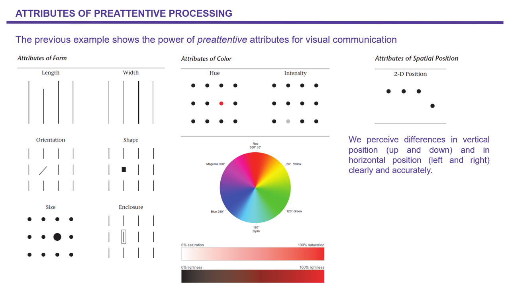
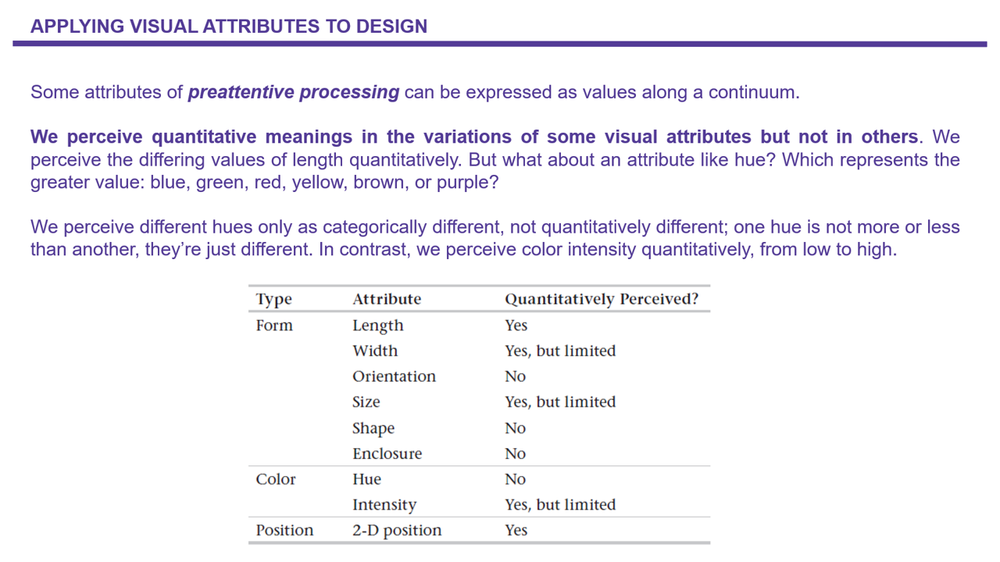
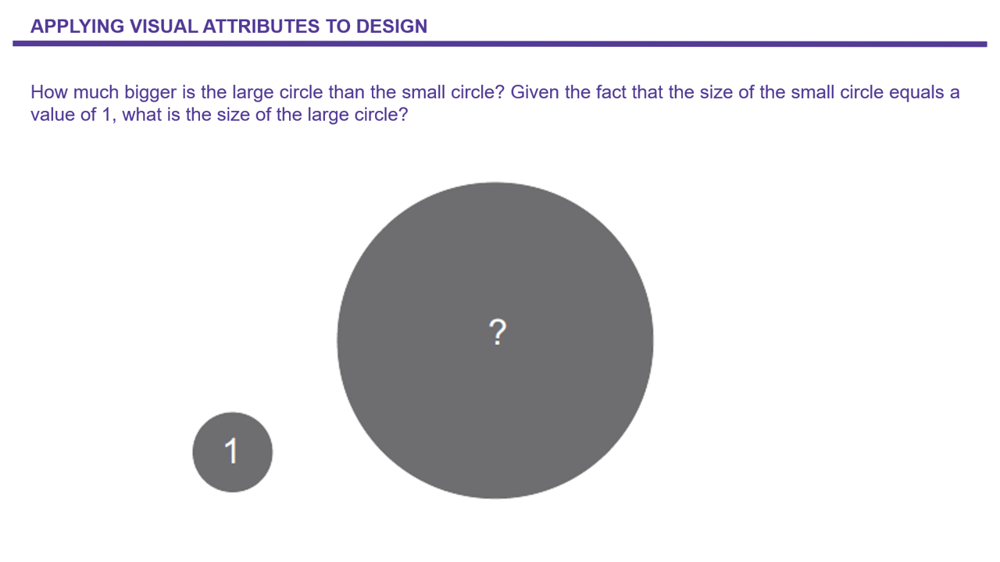

------------------------------------------------------------------------

**Place and Date:** *Centre d'Estudis Demogràfics, July 2025*

**Instructor:** [Juan Galeano](https://drive.google.com/file/d/1m9uciUygDKKKNrGljDLj5sYtMXqUQHOs/view?usp=sharing)

------------------------------------------------------------------------

## 1. Heatmaps: AIRBNB BARCELONA.

#### 1.1 Read sf object from a R library.

```{r fig.width=12, fig.height=10,echo = T, message = F, warning=FALSE}
setwd("C:\\Users\\jgaleano\\Desktop\\ADAM\\SESSION_3_BSSD")
library(tidyverse)
library(sf)
library(ggmap)
library(RColorBrewer)

theme_HS<-list(theme(plot.title = element_text(lineheight=1, size=30, face="bold",hjust = 0.5), 
                     plot.subtitle = element_text(lineheight=1, size=25, face="bold",hjust = 0.5), 
                     plot.caption = element_text(lineheight=1, size=15, hjust=0.5), 
                     legend.title = element_blank (),
                     legend.text = element_text(colour="black", size = 13), 
                     legend.position="bottom", 
                     legend.background = element_rect(fill=NA, colour = NA), 
                     legend.key.size = unit(1.5, 'lines'), 
                     legend.key = element_rect(colour = NA, fill = NA), 
                     axis.title.x = element_blank (),
                     axis.text.x  = element_blank (), 
                     axis.title.y =  element_blank (), 
                     axis.text.y  = element_blank (), 
                     axis.ticks= element_blank (), 
                     strip.text = element_text(size=15, face="bold",margin = margin(.1,0,.1,0, "cm")), 
                     plot.background =  element_rect(fill = "white"), 
                     panel.grid.major=element_line(colour="white",linewidth=.5), 
                     panel.grid.minor=element_line(colour="white",linewidth=.15), 
                     panel.border = element_rect(colour = "white", fill=NA, linewidth=.75), 
                     panel.background =element_rect(fill ="#FFFFFF", colour = "#FFFFFF")))


AIRBNB_BCN<- read_sf(".", "airbnb_data_bcn_2022")

DIST_BCN <- read_sf(".", "bcn_districts")

DIST_BCN2<-st_transform(
  DIST_BCN,4326)

bbox<-st_bbox(DIST_BCN2)

left<-(as.numeric(bbox[1])-mean(as.numeric(bbox[c(1,3)])))*1.1+mean(as.numeric(bbox[c(1,3)]))
right<-(as.numeric(bbox[3])-mean(as.numeric(bbox[c(1,3)])))*1.1+mean(as.numeric(bbox[c(1,3)]))
bottom<-(as.numeric(bbox[2])-mean(as.numeric(bbox[c(2,4)])))*1.1+mean(as.numeric(bbox[c(2,4)]))
top<-(as.numeric(bbox[4])-mean(as.numeric(bbox[c(2,4)])))*1.1+mean(as.numeric(bbox[c(2,4)]))

BCN_TILE<-get_stadiamap(bbox = c(left = left, 
                             bottom = bottom, 
                             right = right,
                             top = top ), 
                    zoom = 14,  
                    maptype = c("stamen_toner_lite"), 
                    crop = TRUE,
                    messaging = FALSE)

BCN_TILE <- ggmap(BCN_TILE)
#BCN_TILE 

AIRBNB_BCN<- cbind (AIRBNB_BCN,st_coordinates(AIRBNB_BCN))
points_BCN<- st_centroid(DIST_BCN2)
points_BCN <- cbind(DIST_BCN2, st_coordinates(st_centroid(points_BCN$geometry)))


BCN_HEATMAP <- BCN_TILE+
  stat_density2d(aes(x = X, 
                     y = Y, 
                     fill = after_stat(level)), #colour= ..level.. 
                 color="black",
                 alpha=.45,
                 bins = 12, 
                 linewidth=0.1,
                 data = AIRBNB_BCN, 
                 geom = "polygon")+ 
  scale_fill_gradient2 ('Cholera Deaths\n2D Density',
                        low = '#2b83ba', 
                        mid = '#ffffbf',
                        high = '#d7191c', 
                        midpoint=500)+
    labs(title="AIRBNB ACCOMODATIONS",
       subtitle="Barcelona, 2022",
       caption="\nElaboration: Juan Galeano for the BSSD\nData: http://insideairbnb.com/")+
  geom_sf(data=DIST_BCN2, linewidth=.5,fill=NA,color="black",inherit.aes = FALSE)+
  geom_sf(data=AIRBNB_BCN, size=.25, shape=15, alpha=.5,color="black",inherit.aes = FALSE)+
  geom_label(data= points_BCN,
             aes(x=X, y=Y, label=NOM),
             color = "black", 
             fontface = "bold", 
             size=7,
             fill = "lightgrey")+ 
  coord_sf(xlim = c(2.12, 2.22), ylim = c(41.365, 41.42))+
  theme_HS+
  theme(legend.position="bottom",
        legend.key.width=unit(6.3,"cm"))

BCN_HEATMAP

ggsave("./IMAGENES/1_HEATMAP.png",
       scale = 1,
       height = 12,
       width=13, 
       dpi = 300)

```

#### 1.2: Hexabin maps, count point in polygons

Hexabin maps, or hexagon bin maps, are a type of data visualization technique that helps overcome some limitations of traditional point maps. In a hexabin map, the geographic space is divided into hexagonal bins, and the density of data points within each bin is represented by color intensity or shading.     

Here’s how hexabin maps work:     

**Hexagonal Binning:** Instead of representing each individual data point on a map, hexagon bins are placed over the geographic area. These hexagons act as containers for the data.     
     
**Data Aggregation:** Data points falling within a specific hexagon are counted or aggregated in some way (e.g., summing values, calculating averages).     
     

**Color Representation:** The hexagons are then colored or shaded based on the aggregated data. The color intensity indicates the density or magnitude of the data within each hexagon.     
     
**Visual Clarity:** Hexagons are preferred over squares or other shapes because they provide a more natural and aesthetically pleasing arrangement. They also eliminate bias that might arise from using grid-based binning.     
     
Hexabin maps are often used when dealing with large datasets of point-based information, such as geographical locations of events or occurrences. They offer a balance between the simplicity of point maps and the complexity of continuous surface maps. The hexagon shape allows for a more uniform representation of space, and the aggregation of data points within each hexagon helps in visualizing patterns and trends without overwhelming the map with individual points.     

```{r fig.width=12, fig.height=10,echo = T, message = F, warning=FALSE}

bcn_CITY <-DIST_BCN2 |> 
  group_by(ID_ANNEX) |> 
  summarise(NAME_prov = unique(ID_ANNEX)) |> 
  #st_buffer(0.25) |> 
  st_cast() 

ggplot(data = bcn_CITY) + 
  geom_sf(linewidth=.1)

bcn_hexa_grid <- st_make_grid(AIRBNB_BCN, c(.0025, .0025), what = "polygons", square = FALSE)

bcn_hexa_grid_sf <- st_sf(bcn_hexa_grid) |>
  # add grid ID
  mutate(grid_id = 1:length(lengths(bcn_hexa_grid)))

ggplot(data = bcn_hexa_grid_sf) + 
  geom_sf(linewidth=.1)

```

#### 1.3: Intersect layers (clip) 

```{r fig.width=12, fig.height=10,echo = T, message = F, warning=FALSE}

bcn_hexa<- st_intersection(bcn_CITY,bcn_hexa_grid_sf)

ggplot(data = bcn_hexa) + 
  geom_sf(linewidth=.1)

```

#### 1.4: Hexabin Map

```{r fig.width=12, fig.height=10,echo = T, message = F, warning=FALSE}
bcn_hexa$pt_count <- lengths(st_intersects(bcn_hexa, AIRBNB_BCN))

myColors <- c("#BFBFBF", rev(brewer.pal(7, "Spectral")))

bcn_hexa$pt_count<-ifelse(bcn_hexa$pt_count==0,NA,bcn_hexa$pt_count)
MAP4 <- ggplot(bcn_hexa, 
               aes(fill = pt_count)) + 
  geom_sf(colour = "black",linewidth=.025)+
  scale_fill_distiller(palette = "Spectral",
                       name="Airbnb offers",
                       na.value = "#EBEBEB")+
  labs(x="\nLongitude",
       y="Latitude\n",
       title="Foreign-born population by municipalities",
       subtitle="Barcelona 2022",
       caption="Elaboration: BSSD\nData: Population Register (INE)")+
  theme(legend.position = "right", 
        plot.title = element_text(lineheight=1, size=10, face="bold"),
        plot.subtitle = element_text(vjust=0.5, size=8,colour="black"),
        plot.caption = element_text(vjust=0.5, size=6,colour="black"),
        legend.title = element_text(angle = 0,vjust=0.5, size=8,colour="black",face="bold"),
        legend.text = element_text(vjust=0.5, size=8,colour="black"),
        axis.line=element_blank(), 
        axis.text.x=element_blank(), axis.title.x=element_blank(),
        axis.text.y=element_blank(), axis.title.y=element_blank(),
        axis.ticks=element_blank(), 
        panel.background = element_blank()) 

MAP4
ggsave("./IMAGENES/2_AIRBNB_HEXA.png", 
       scale = 1,
       height = 12,
       width=20,
       dpi = 300)

```

#### 1.5: Hexabin Map using a map tile

```{r fig.width=12, fig.height=10,echo = T, message = F, warning=FALSE}
MAP4b <- BCN_TILE+
  geom_sf(data=bcn_hexa, 
          aes(fill = pt_count),
          colour = "black",
          size=.01,
          inherit.aes = FALSE)+
  scale_fill_distiller(palette = "Spectral",
                       name="Airbnb offers",
                       na.value = "#EBEBEB")+
  labs(x="\nLongitude",
       y="Latitude\n",
       title="AIRBNB Accommodations",
       subtitle="Barcelona 2022",
       caption="Elaboration: BSSD\nData: Population Register (INE)")+
   theme_HS+
  theme(legend.position="bottom",
        legend.key.width=unit(4.5,"cm"))
 
MAP4b

ggsave("./IMAGENES/3_AIRBNB_HEXA_tile.png", 
       scale = 1,
       height = 12,
       width=20, 
       dpi = 300)

```


## 2. Bubbles maps 

    
    
    

```{r fig.width=12, fig.height=10,echo = T, message = F, warning=FALSE}
load("population_register_catalonia_2020.Rdata")

countries<-c(407,110) # 407: china, 110 France

df_mun<-pc2020cat|>
  filter(PAISNAC%in%countries)|>
  group_by(MUNICIPIO,PAISNAC)|>
  summarise(pop=n())|>
  ungroup()|>
  mutate(prop=pop/sum(pop)*100,.by=c(PAISNAC), 
         PAISNAC2 = case_when(PAISNAC == 407 ~ "CHINA", 
                              PAISNAC == 110 ~ "FRANCE"))


df_mun <- df_mun |> 
  mutate(prop_cat=as.factor(
           ifelse(prop<.5, "<0.5%",
           ifelse(prop<=1, "(0.5-1%]",
           ifelse(prop<=3, "(1-3%]",
           ifelse(prop<=5, "(3-5%]",
          ifelse(prop<=10, "(5-10%]",
                 ">10%")))))),
         prop_cat=fct_relevel(prop_cat,
                                      "<0.5%",
                                      "(0.5-1%]",
                                      "(1-3%]",
                                      "(3-5%]",
                                      "(5-10%]",
                                      ">10%"))

mysizes <-rev(c(8,5,3.5,2,1,.5,.1))
names(mysizes) <- levels(df_mun$prop_cat)

load("DATA_SPAIN.Rdata")

dt<-DATOS|>
  filter(YEAR==2016,COM=="Catalonia")|>select(1:3,13:15)

colnames(df_mun)[1]<-"CODMUN"

df_mun<-df_mun|>
  left_join(dt,by ="CODMUN")

df_mun_sf<-st_as_sf(df_mun, 
                       coords=c("LON", "LAT"),
                       crs=4236)

library(tidyterra)
library(slippymath)
library(mapSpain)
# note osm for getting bbox

Basemap <- esp_getTiles(df_mun_sf,"IGNBase.Gris",
                        bbox_expand = 0.1, zoom =10) 


ggplot() +
  geom_spatraster_rgb(data = Basemap, maxcell = 10e6)+
  geom_sf(data=df_mun_sf,aes(size = prop_cat,color=PAISNAC), shape =21)+
  geom_sf(data=df_mun_sf,aes(size = prop_cat,color=PAISNAC), #shape =21,
          #color="red",
          alpha=.2)+
  scale_fill_brewer(palette="Set1")+
  scale_color_brewer(palette="Set1")+
  scale_size_manual(values=mysizes*8,name = "Population",
                    guide = guide_legend(direction = "horizontal",
                                         nrow = 1,
                                         keywidth=5,
                                         label.position = "bottom"))+
  guides(colour = "none")+
  facet_wrap(~PAISNAC2)+
  labs(title="\nPopulation distribution (%) by municipalities",
       subtitle = "Catalonia 2020", 
       caption="\nElaboration: Juan Galeano for the Barcelona Summer School of Demography\n\nData: INE (https://missingmigrants.iom.int/downloads)\n")+
  theme_void()+
  theme(plot.title = element_text(lineheight=1, size=24,color  =  "#bdbdbd", face="bold", hjust = 0.5),
        plot.subtitle = element_text(lineheight=1, size=15,color  =  "#bdbdbd", face="bold", hjust = 0.5),
        plot.caption = element_text(vjust=0.5, size=12,colour="#bdbdbd", hjust = 0.5),
        legend.position = "bottom",
        legend.text = element_text(size=15,color  =  "#bdbdbd", face="bold"),
        legend.title = element_text(size=15,color  =  "#bdbdbd", face="bold"),
        panel.background = element_rect(fill = "white", color  =  "white"), 
        plot.background = element_rect(fill ="white", color  = "white"), 
        panel.grid.major = element_line(color = "white",
                                        linewidth = 0.15,
                                        linetype = 2))

ggsave("./IMAGENES/4_BUBBLES_MAP.png", 
       scale = 1,
       height = 12,
       width=20, 
       dpi = 300)

```


## CONSOLIDATION EXERCISE 1: HEXABIN MAP

In folder **CONSOLIDATION_EX1** you will find a shapefile with the delimitation by neighborhoods of the municipality of Madrid a shapefile with the locations of bars in Madrid as recorded in Open Street Maps. Your tasks are:

1) To read these 3 shapefiles into R. 
2) Do these files share the same CRS? Whatever is the case, transform everything to CRS = 4326.
3) Create an hexabin map using the location of the bars. Use a map tile for your final map and add two or three labels indicating the neighborhoods we must visit the next time we are in Madrid in case we want to have a handful of bars around. Save your final map as an image.  


## CONSOLIDATION EXERCISE 2: MARE NOSTRU MARE MORTUM

In the folder **CONSOLIDATION_EX2** you will find the file Missing_Migrants.xlsx, please read it
into R and perform the following tasks. HINT: library(readxl); data <- read_excel()

1. Filter cases where "Region_Incident" is equal to Mediterranean.
2. Drop those cases where "Coordinates" is equal to NA. Hint: drop_na() 
3. You will need to separate the coordinates into two columns. You can use the following
expression:
```{r fig.width=16.5, fig.height=9.8,echo = T, message = F, warning=FALSE}
# medi$lon<-as.numeric(sub("^.*?,", "",  medi$Coordinates))
# medi$lat<-as.numeric(gsub(",.*$", "", medi$Coordinates))
```

4. Change the name of column 8 to "deaths". Hint: colnames().
5. Drop those cases where deaths is equal to NA.
6. Filter cases deaths >0.
7. Create categories for deaths as the ones in the map below.
8. Convert your dataframe to a sf object. Hint:st_as_sf
9. Get a map of the world. Hint: giscoR.
```{r fig.width=16.5, fig.height=9.8,echo = T, message = F, warning=FALSE}
library(giscoR)
res <- "03"
target_crs <- 4326
world <- gisco_get_countries(
  resolution = res, region = NULL,
  epsg = target_crs
)
```

10. Plot a bubble map as the one below. It's not mandatory to replicate the aesthetics of the map below. 

```{r fig.width=12, fig.height=10,echo = F, message = F, warning=FALSE}

library(readxl)
data <- read_excel("./CONSOLIDATION_EX2/Missing_Migrants.xlsx")

medi<-data|>filter(Region_Incident=="Mediterranean")

medi<-medi|>drop_na(Coordinates)

medi$lon<-as.numeric(sub("^.*?,", "",  medi$Coordinates))
medi$lat<-as.numeric(gsub(",.*$", "", medi$Coordinates))

colnames(medi)[8]<-"deaths"
#summary(medi$deaths)
medi<-medi|>drop_na(deaths)
medi<-medi|>filter(deaths>0)

medi$deaths_c<-with(medi, ifelse(deaths<=5, '<=5',
                          ifelse(deaths<=25,"[5-25)",
                          ifelse(deaths<=50,"[25-50)",
                          ifelse(deaths<=100,"[50-100)",
                          ifelse(deaths<=250,"[100-250)",
                                 '>250'))))))

medi$deaths_c<-as.factor(medi$deaths_c)

medi$deaths_c <- factor(medi$deaths_c,
                            levels = rev(c(">250",
                                       "[100-250)",
                                       "[50-100)",
                                       "[25-50)",
                                       "[5-25)",
                                       '<=5')))

mysizes <-rev(c(8,5,3.5,2,1,.5))
names(mysizes) <- levels(medi$deaths_c)

deaths<-st_as_sf(medi, coords=c("lon","lat"))

library(giscoR)
res <- "03"
target_crs <- 4326
world <- gisco_get_countries(
  resolution = res, region = NULL,
  epsg = target_crs
)

deaths<-deaths |> st_set_crs(st_crs(world))

mare_mortum<-ggplot() +
  geom_sf(data = world[world$CNTR_NAME!="Antarctica",],linewidth=.05, color= "#2A2A28", fill="#bdbdbd", alpha=1)+
  geom_sf(data=deaths,aes(size = deaths_c), shape =21,
          color="red")+
  geom_sf(data=deaths,aes(size = deaths_c), #shape =21,
          color="red",alpha=.2)+
  scale_size_manual(values=mysizes*4,name = "Deaths",
                    guide = guide_legend(direction = "horizontal",
                                         nrow = 1,
                                         keywidth=5,
                                         label.position = "bottom"))+
  coord_sf(xlim = c(-12, 40), ylim = c(25, 50), expand = FALSE)+
  labs(title="\nMare Nostrum / Mare Mortum",
       subtitle = "Between 2014 and 2023, 10,000 people have died in the Mediterranean\n", 
       caption="\nElaboration: Juan Galeano for the Barcelona Summer School of Demography\n\nData: OIM (https://missingmigrants.iom.int/downloads)\n")+
  theme_void()+
  theme(plot.title = element_text(lineheight=1, size=24,color  =  "#bdbdbd", face="bold", hjust = 0.5),
        plot.subtitle = element_text(lineheight=1, size=15,color  =  "#bdbdbd", face="bold", hjust = 0.5),
        plot.caption = element_text(vjust=0.5, size=12,colour="#bdbdbd", hjust = 0.5),
        
        legend.position = "bottom",
        legend.text = element_text(size=15,color  =  "#bdbdbd", face="bold"),
        legend.title = element_text(size=15,color  =  "#bdbdbd", face="bold"),
        panel.background = element_rect(fill = "#02101B", color  =  "#02101B"), 
        plot.background = element_rect(fill = "#02101B", color  = "#02101B"), 
        panel.grid.major = element_line(color = "#02101B",
                                        linewidth = 0.15,
                                        linetype = 2),
        panel.grid.minor = element_line(color = "#02101B",
                                        linewidth = 0.1,
                                        linetype = 1))


mare_mortum

ggsave("EX2.png", # name of the file of the image
       plot=mare_mortum,
       scale = 1, 
       dpi = 300,     
       height =10,    
       width = 11)

```

## CONSOLIDATION EXERCISE 3: BUBBLE MAPS


In folder **CONSOLIDATION_EX3** you’ll find the Rda file mad_pop and a shapefile (SECC_CE_20220101) with the division of Spain by census tracts. **mad_pop** in individual level microdata of the population living in Madrid in 2022. Column PAISNAC indicates the country of birth of each individual.       

Please, read both files into R and create a faceted bubble map showing the relative distribution across municipalities in the region of Madrid of four population groups: Venezuelans, Argentinians, Romanians, and U.S. citizens. The numeric code of these for groups are: # 302: US, 351: Venezuela, 340: Argentina, 128: Romania. Please also use a map tile for your final map.     
Your outcome map should look similar to the one below.

```{r fig.width=10, fig.height=12,echo = F, message = F, warning=FALSE}
path<-"C:\\Users\\jgaleano\\Desktop\\ADAM\\SESSION_3_BSSD\\CONSOLIDATION_EX3\\"

load(paste(path,"mad_pop.Rda",sep=""))

groups<-mad|>
group_by(PAISNAC)|>
summarise(n=n())|>
mutate(n_rel = round(n / sum(n)*100,2))|>
arrange(-n_rel)|>
  slice_head(n = 20)

#groups

countries<-c(302,351,340,128) # 302: US, 351: Venezuela, 340: Argentina, 128: Romania 

df_mun<-mad|>
  filter(PAISNAC%in%countries)|>
  group_by(MUNICIPIO,PAISNAC)|>
  summarise(pop=n())|>
  ungroup()|>
  mutate(prop=pop/sum(pop)*100,.by=c(PAISNAC), 
         PAISNAC2 = case_when(PAISNAC == 302 ~ "US", 
                              PAISNAC == 351 ~ "Venezuela",
                              PAISNAC == 340 ~ "Argentina",
                              PAISNAC == 128 ~ "Rumania",
                              ))


df_mun <- df_mun |> 
  mutate(prop_cat = as.factor(case_when(
    prop < 0.5     ~ "<0.5%",
    prop <= 1      ~ "(0.5-1%]",
    prop <= 3      ~ "(1-3%]",
    prop <= 5      ~ "(3-5%]",
    prop <= 10     ~ "(5-10%]",
    TRUE           ~ ">10%"
  )),
    prop_cat=fct_relevel(prop_cat,
                         "<0.5%",
                         "(0.5-1%]",
                         "(1-3%]",
                         "(3-5%]",
                         "(5-10%]",
                         ">10%"))

mysizes <-rev(c(8,5,3.5,2,1,.5,.1))

shp_ct  <- read_sf(dsn = path, "SECC_CE_20220101")

mad_muns_shp <- shp_ct |>
  filter(CPRO == "28") |>
  group_by(CUMUN) |>
  summarise(NMUN = unique(NMUN)) |>
  st_buffer(0.5) %>%
  st_cast() 

#st_crs(mad_muns_shp)

mad_muns_shp<-st_transform(mad_muns_shp,4326)

centroid_mad_muns<- st_centroid(mad_muns_shp)

colnames(centroid_mad_muns)[1]<-"MUNICIPIO"

sf_final<-centroid_mad_muns|>
  left_join(df_mun,by ="MUNICIPIO")


library(tidyterra)
library(slippymath)
library(mapSpain)
# note osm for getting bbox

Basemap <- esp_getTiles(mad_muns_shp,"IGNBase.Gris",
                        bbox_expand = 0.1, zoom =10) 

sf_final<-sf_final|>drop_na()

map4<-ggplot() +
  geom_spatraster_rgb(data = Basemap, maxcell = 10e6)+
  geom_sf(data=mad_muns_shp,fill=NA, color="black", linewidth=.1)+
  geom_sf(data=sf_final,aes(size = prop_cat,color=PAISNAC), shape =21)+
  geom_sf(data=sf_final,aes(size = prop_cat,color=PAISNAC), #shape =21,
          #color="red",
          alpha=.2)+
  scale_fill_brewer(palette="Set1")+
  scale_color_brewer(palette="Set1")+
  scale_size_manual(values=mysizes*4,name = "Population",
                    guide = guide_legend(direction = "horizontal",
                                         nrow = 1,
                                         keywidth=5,
                                         label.position = "bottom"))+
  guides(colour = "none")+
  facet_wrap(~PAISNAC2)+
  labs(title="\nPopulation distribution (%) by municipalities",
       subtitle = "Madid 2022", 
       caption="\nElaboration: Juan Galeano for the Barcelona Summer School of Demography\n\nData: INE (https://missingmigrants.iom.int/downloads)\n")+
  theme_void()+
  theme(plot.title = element_text(lineheight=1, size=24,color  =  "#bdbdbd", face="bold", hjust = 0.5),
        plot.subtitle = element_text(lineheight=1, size=15,color  =  "#bdbdbd", face="bold", hjust = 0.5),
        plot.caption = element_text(vjust=0.5, size=12,colour="#bdbdbd", hjust = 0.5),
        legend.position = "bottom",
        legend.text = element_text(size=15,color  =  "#bdbdbd", face="bold"),
        legend.title = element_text(size=15,color  =  "#bdbdbd", face="bold"),
        panel.background = element_rect(fill = "white", color  =  "white"), 
        plot.background = element_rect(fill ="white", color  = "white"), 
        panel.grid.major = element_line(color = "white",
                                        linewidth = 0.15,
                                        linetype = 2))

map4
```